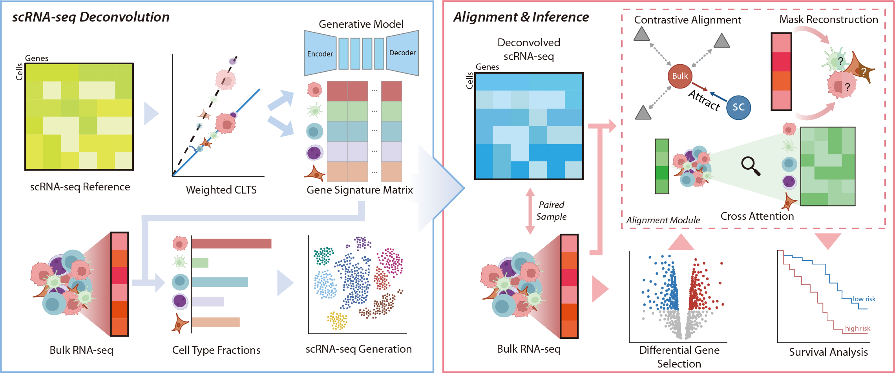

<p align="center">
  
</p>

<h1 align="center">DeSCENT</h1>

<p align="center">
  <b>De</b>convolution-guided <b>S</b>ingle-<b>C</b>ell <b>E</b>xpression for Survival Predictio<b>N</b> using <b>T</b>ranscriptomics
</p>

<p align="center">
  <a href="#quick-start">Quick Start</a> &middot;
  <a href="#pipeline">Pipeline</a> &middot;
  <a href="#notebook-demo">Notebook Demo</a> &middot;
  <a href="#configuration">Configuration</a> &middot;
  <a href="#project-structure">Project Structure</a>
</p>

---

## Quick Start

```bash
conda env create -f environment.yml
conda activate descent
export LD_LIBRARY_PATH=$CONDA_PREFIX/lib:$LD_LIBRARY_PATH
```

> The `LD_LIBRARY_PATH` export fixes `CXXABI_1.3.15` errors on older systems. All shell scripts set it automatically.

Smoke test (5-fold survival CV, 300 epochs, BRCA):

```bash
./scripts/run_survival_test.sh
```

## Pipeline

DeSCENT has three stages: ReDeconv → Condgen → Survival CV.

```
bulk RNA-seq + scRNA-seq reference
        │
        ▼
  ReDeconv ──► cell fractions
        │
        ▼
  scDiffusion condgen ──► synthetic scGEP (.npz)
        │
        ▼
  Multimodal survival CV (bulk + scGEP + DEG) ──► C-index
```

### Option A: Shell Scripts

```bash
# Part 1: ReDeconv + conditional scGEP generation
./scripts/run_part1_deg_redeconv_condgen.sh BRCA

# Part 2: Multimodal survival prediction (5-fold CV)
./scripts/run_part2_survival.sh BRCA

# Or run the full pipeline in one go
./scripts/run_full_pipeline_test.sh BRCA
```

### Option B: Jupyter Notebook

An interactive notebook covers the same pipeline with inline visualizations:

**[`notebooks/descent_pipeline_demo.ipynb`](notebooks/descent_pipeline_demo.ipynb)**

The notebook runs each step via `!python` shell commands (faithful to the shell scripts) and produces plots for cell fractions, generated scGEP stats, C-index per fold, and training curves. Change `CANCER = "BRCA"` in the first code cell to switch cancer types.

> **Note:** The full pipeline is compute-intensive. ReDeconv and condgen each require GPU time; survival CV trains for 300 epochs × 5 folds. For a quick demo, the notebook uses 4 samples for condgen and you can reduce `EPOCHS` to 30.

## Notebook Demo

| Step | What it does | Output |
|------|-------------|--------|
| Step 1 — ReDeconv | Estimate cell-type fractions from bulk RNA-seq | `output/redeconv_fraction/{CANCER}/` |
| Step 2 — Condgen | Generate synthetic scGEP via scDiffusion | `output/scgep_condgen/{CANCER}/redeconv/` |
| Step 3 — Survival CV | Multimodal 5-fold CV (bulk + scGEP + DEG) | `output/survival_cv/{CANCER}/cv_summary.json` |

Each step includes a visualization cell: stacked bar / box plots for cell fractions, .npz inspection for condgen, and C-index bar chart + training curves for survival.

## Configuration

All paths are in `config/path_local.json`, keyed by cancer type. Example for BRCA:

| Key | Purpose |
|-----|---------|
| `VAE`, `diffusion_backbone`, `classifier` | Model checkpoints (relative to repo root) |
| `sc_npz` | Pre-generated scGEP directory |
| `bulk`, `surv_label` | Bulk expression and survival label directories (5-fold splits) |
| `gene_list` | Gene order CSV for generation |
| `redeconv_ref` | Reference scRNA-seq for ReDeconv |
| `bulk_tpm` | TPM-normalized bulk for ReDeconv input |
| `celltypes` | Cell fraction output from ReDeconv |

Verified cancers: **BRCA**, **COAD**, **HNSC**, **KIRC**, **LGG**, **LIHC**, **LUAD**, **STAD**.

## Project Structure

```
DeSCENT/
├── scgep_generation/           # Chapter 1: scGEP Generation
│   ├── redeconv/               # Bundled ReDeconv (patched fork — do NOT pip install)
│   ├── VAE/                    # VAE encoder/decoder for gene expression latent space
│   ├── guided_diffusion/       # Diffusion backbone + classifier
│   ├── pipeline_scripts/       # run_redeconv_full.py, run_diffusion_condgen.py
│   └── generate_bulk_from_diffusion.py
├── survival_prediction/        # Chapter 2: Survival Prediction
│   ├── scrna_bulk_sc_survival_cv.py   # Main entry: 5-fold CV
│   ├── mil_survival_model.py          # MIL-based multimodal model
│   ├── mil_survival_training.py       # Training utilities
│   ├── survival_data.py               # Data loading
│   └── bulk_sample.py                 # Bulk prep
├── notebooks/
│   └── descent_pipeline_demo.ipynb    # Interactive pipeline demo
├── config/
│   ├── path.json               # scDiffusion-main variant
│   └── path_local.json         # Project-level config
├── scripts/
│   ├── run_part1_deg_redeconv_condgen.sh
│   ├── run_part2_survival.sh
│   ├── run_full_pipeline_test.sh
│   └── run_survival_test.sh
├── output/                     # All outputs (not in git)
│   ├── redeconv_fraction/
│   ├── scgep_condgen/
│   └── survival_cv/
├── data/                       # Input data & model checkpoints
└── environment.yml
```

## Important Notes

- **Bundled ReDeconv**: `scgep_generation/redeconv/` is a patched fork. Running `pip install redeconv` will silently replace it with the vanilla version and break the pipeline.
- **GPU memory**: Pipeline scripts call `gpu_cleanup()` between steps to avoid OOM when running sequentially.